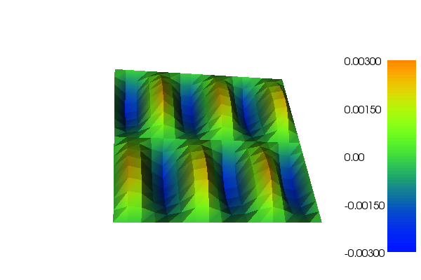

Very short introduction to FEniCS
=================================

**Task 1.** Start interactive Python session and type in following code.

.. code-block:: python

   >>> from dolfin import *

   >>> mesh = UnitSquareMesh(16, 16)
   >>> V = FunctionSpace(mesh, 'Lagrange', 3)
   Calling FFC just-in-time (JIT) compiler, this may take some time.

We see JIT compilation of finite element code, i.e. C++ code is generated
by FFC (FEniCS from compiler) and compiled by C++ compiler. This is done
once and will not be done again with different mesh. The result is
cached in ``~/.instant``.

.. code-block:: python

   >>> f = Expression("sin(6.0*pi*x[0])*sin(2.0*pi*x[1]")
   Calling DOLFIN just-in-time (JIT) compiler, this may take some time.

This is compiled C++ expression which is evaluated very quickly when evaluated
but requires JIT compilation.

.. code-block:: python

   >>> def boundary(x, on_boundary):
   ...     return on_boundary
   ...
   >>> bc = DirichletBC(V, 0.0, boundary)

The function ``boundary`` defines boundary of the domain and ``bc`` represents
Dirichlet boundary condition on space ``V``.

.. code-block:: python

   >>> u = TrialFunction(V)
   >>> v = TestFunction(V)
   >>> a = inner(grad(u), grad(v))*dx
   >>> L = f*v*dx

This code defines bilinear form ``a`` and linear form ``L`` using UFL (Unified
form language).

.. code-block:: python

   >>> u = Function(V)
   >>> solve(a == L, u, bc)
   Calling FFC just-in-time (JIT) compiler, this may take some time.
   Calling FFC just-in-time (JIT) compiler, this may take some time.
   Solving linear variational problem.

Finally we create finite-element function ``u`` on space ``V``. (``TrialFunction``
and ``TestFunction`` were only thought arguments of multi-linear forms - not a
real function with its values in memory.) The we ask DOLFIN to assemble
linear system for the respective problem and solve it by some linear algebra
backend. For the former C++ code to assemble forms ``a`` and ``L`` is again
generated by FFC and compiled by C++ compiler. This is again mesh independent
so that it won't be done again when refining a mesh. (Note that the solution
process can be controlled in a much detailed way.)

.. code-block:: python

   >>> plot(u, interactive=True))

**Task 2.** Prepare ``.py`` file with the code above and try executing it from
shell. Try also running it in parallel using ``mpirun`` command.

**Task 3.** Modify boundary condition on :math:`x=0,1` to homogeneous Neumann.

**Task 4.** Modify :math:`-\Delta` operator to non-linear
:math:`-\mathrm{div} (1+k\,u^2) \nabla` for some large :math:`k`.
(Write linear form depending non-linearly on unknown ``Function`` and provide
``F == 0`` instead of ``a == L`` to ``solve`` function. Use ``Constant`` class
for ``k`` to avoid form recompilation when changing ``k``.)
